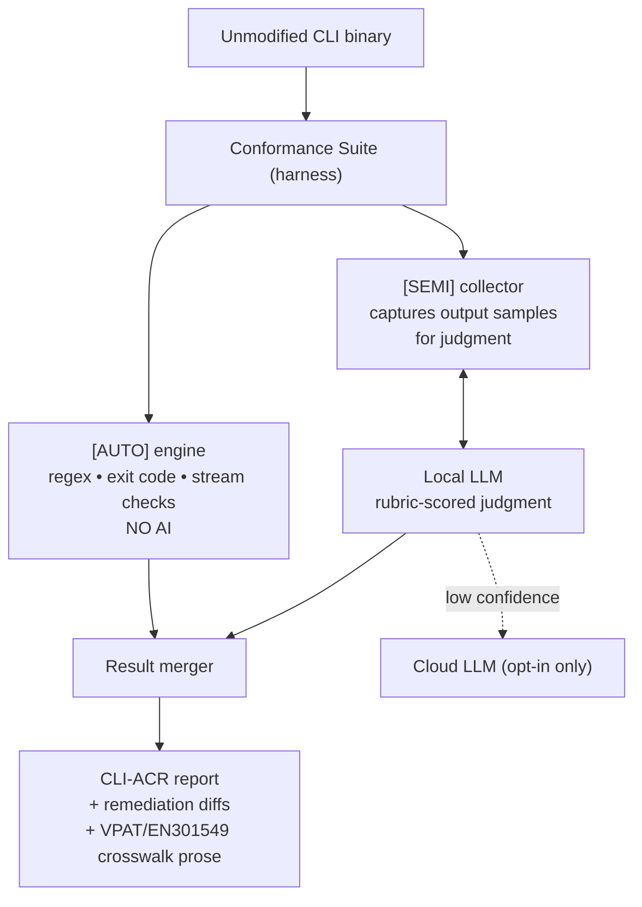

# AI in Conformance Evaluation (Build / CI time)

**Goal:** close the `[SEMI]` gap the automated suite can't judge, and draft the CLI-ACR report + fixes. AI never touches `[AUTO]` (pure code) or the `[MANUAL]` verdict (real AT required).

## Architecture

## What AI does here

| Task | Criteria examples | Output |
|---|---|---|
| Judge message quality | ES (actionable errors), HD (help clarity) | pass/fail + reason |
| Judge linear/semantic output | OS-4, OS-5, CV-1 | pass/fail + reason |
| Draft report prose | Section 7 remarks, crosswalk | markdown |
| Suggest fixes | any failing criterion | code diff / rewrite |

## Tech stack

- **Harness:** Go or Python (spawn binary, set env, capture fd 1/2 + exit code).
- **Local LLM runtime:** `llama.cpp` / Ollama; quantized 7–8B class model (Qwen2.5, Llama 3.1, Phi).
- **Determinism:** pinned model + `temperature=0` + versioned prompt rubrics.
- **Output:** JSON (machine) + markdown (CLI-ACR).

## Challenges

1. **Reproducibility** — LLM verdicts must be stable across runs. Pin model hash, temp=0, snapshot prompts. Treat model+prompt as a versioned artifact in the report.
2. **Rubric drift** — vague prompts give inconsistent scores. Each `[SEMI]` criterion needs a concrete scoring rubric, not "is this good?".
3. **Hallucinated fixes** — suggested diffs may not compile. Mark them advisory; never auto-apply. Ideally re-run the suite on the patched output to validate.
4. **Sampling** — the suite must feed the LLM representative output (error cases, help text, tabular output), not the whole log. Garbage in → wrong verdict.
5. **False confidence** — an LLM "pass" is not AT verification. Report must label `[SEMI]` verdicts as AI-assisted, `[MANUAL]` as still-required.
6. **Model footprint in CI** — a multi-GB model in CI runners. Cache the model layer; allow a remote-inference opt-in for constrained runners.
