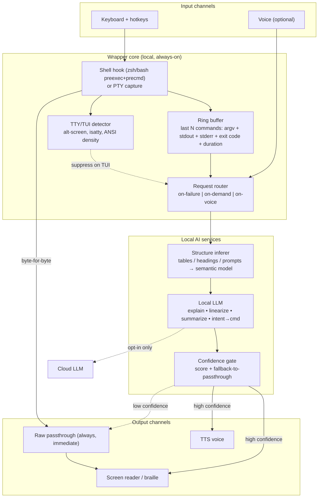
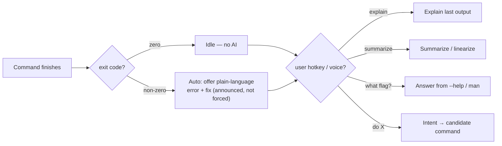
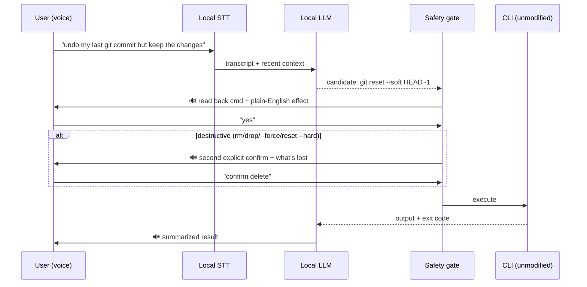

# AI in the Accessible Wrapper (Runtime)

**Goal:** help a disabled user *today* on unmodified CLIs. Zero publisher change. AI is **additive and on-demand** — the raw stream always reaches the user untouched; AI augments only on failure or explicit request.

**Design invariants (never violated):**
1. Raw stdout/stderr reaches the terminal/AT immediately, byte-for-byte.
2. AI never sits in the execution hot path — it reads a *copy* of captured output.
3. AI never auto-executes a command. It proposes; the user commits.
4. Everything works offline on an unmodified binary.

---

## Layered architecture

### Component responsibilities

| Component | Job | Key technical detail |
|---|---|---|
| **Capture layer** | Get argv + streams + exit code without disturbing them | `preexec`/`precmd` hooks for simple CLIs; a **PTY wrapper** (`script`-style, `pty.openpty()`) when you need true stdout/stderr separation and TTY semantics |
| **Ring buffer** | Hold recent context so "explain the last thing" works | Bounded (e.g. last 10 commands / 1 MB); redaction pass strips obvious secrets before anything reaches AI |
| **TTY/TUI detector** | Decide engage vs. disengage | Trip on alt-screen enter `\x1b[?1049h`; disengage until `\x1b[?1049l`. Also gate on `isatty`, `TERM=dumb`, ANSI density |
| **Structure inferer** | Rebuild the missing "accessibility tree" | Deterministic pre-parse (detect column alignment, `KEY: value`, box-drawing, prompt patterns) → hand a *structured* payload to the LLM, not raw bytes. Cheaper, more reliable than pure-LLM parsing |
| **Confidence gate** | Prevent confidently-wrong output | LLM returns a self-rated confidence + the inferer returns a parse score; below threshold → **fall back to raw passthrough**, never emit a guess |

---

## Request routing (when AI fires)

- **Failure is the highest-value trigger.** Non-zero exit + stderr is where disabled users lose the most time; AI explains cause + next step automatically (announced politely, never auto-run).
- **Everything else is pull, not push.** No unsolicited chatter — critical for screen-reader users who are already saturated with speech.

---

## Voice path (input) with safety gates

**Gate rules:** LLM proposes, never runs. Read-back before every run. Destructive verbs (`rm`, `drop`, `reset --hard`, `--force`, `>` redirects over files) require a *second* explicit confirmation naming what will be lost. STT low-confidence transcript → ask to repeat, never guess-and-run.

---

## Disability → feature mapping

| User group | Primary barrier on CLI | What the wrapper does | CLI-ACS domains it compensates for |
|---|---|---|---|
| **Blind / low-vision (screen reader)** | Unstructured, non-linear output; noisy ANSI; tables read as gibberish | Linearize tables to `KEY: value`, summarize on demand, strip decor, announce errors | OS-4, OS-5, CV-1, OS-10 |
| **Low-vision (magnifier)** | Loses spatial context in wide/multi-column output | Reflow to narrow linear form; "what changed?" summaries | OS-8, OS-4 |
| **Motor / RSI** | Long commands, many flags, precise retyping | Voice → command; "what flag do I need?" instead of man-page dive; reduces keystrokes | IN domain, HD |
| **Cognitive** | Cryptic errors, jargon, exit codes with no meaning | Plain-language error + concrete next step; quiet/summarized output | ES domain, OS-7 |
| **Speech-impaired** | (voice input not usable) | Fully keyboard-driven; voice is optional, never required | — |

---

## Tech stack

- **Capture:** zsh/bash `preexec`/`precmd` for the common case; **PTY wrapper** (`pty`, `script`) when stream separation or interactive detection is needed.
- **Local LLM:** `llama.cpp` / Ollama; small quantized model (3–8B) for sub-second on-demand latency.
- **STT:** `whisper.cpp` (offline, streaming). **TTS:** Piper (natural) or `espeak-ng`/`say` (low-latency).
- **Structure pre-parser:** deterministic Rust/Go tokenizer (column/alignment/prompt detection) feeding the LLM — keeps AI cost and error rate down.
- **Config:** per-user policy file (trigger modes, redaction rules, destructive-verb list, cloud opt-in).

---

## Challenges (and how the architecture answers them)

1. **No accessibility tree** → deterministic structure inferer + confidence gate; fall back to raw on low confidence. Wrong inference never silently replaces the real output.
2. **Never break the pipe** → capture is a *tee*; raw path is immediate and untouched; AI reads the copy post-hoc. Piping/interactivity (OS-1/OS-3) preserved.
3. **TUIs & interactivity** → alt-screen detection disengages the wrapper entirely; v1 scope = non-interactive Core CLI.
4. **Latency** → on-demand + small local model + pre-parsed structured input → sub-second, no cloud round-trip.
5. **Privacy** → local inference; redaction pass before AI; cloud is explicit opt-in per policy. Terminal output (tokens, keys, PII) never leaves the box by default.
6. **Voice safety** → propose-not-execute, read-back, second gate on destructive verbs, no guess on low-confidence STT.
7. **Distribution** → ship as a single binary + a one-line shell hook install; shell-specific shims for zsh/bash/fish behind one entrypoint.

---

## Prior art & the CLI gap

The "local LLM as an accessibility layer" pattern is already production-real and research-active — but **only for GUI/web/mobile**:

- **Google TalkBack + Gemini Nano** (2024) — on-device LLM generating UI/image descriptions inside the Android screen reader, no network.
- **Savant — "Screen Reading Enabled by LLMs"** (ACM) — LLM gives a uniform, comprehension-based interaction layer over a screen reader instead of linear scanning.
- **"Screen Reader AI"** (2025) — maintains a live *semantic scene* the user queries conversationally.
- **`screen-agent`** (open source) — local, voice-first, on-device LLM (WebLLM/WebGPU) browser assistant for blind/low-vision users; no data leaves the device.

**The gap:** essentially all of this targets screens. The **terminal/CLI is unaddressed** — which is exactly what the spec observes (no accessibility tree for text interfaces). This wrapper applies the proven pattern to the one surface everyone skipped, and the CLI-ACS spec gives it a conformance standard to measure against.

---

## Boundary

The wrapper is a **runtime aid, not conformance**. It can't add data the CLI never emitted (e.g. real `--json`), only best-effort inference. The spec + conformance suite remain the real path to accessible CLIs; the wrapper is the stopgap for the millions of tools that will never be fixed.
